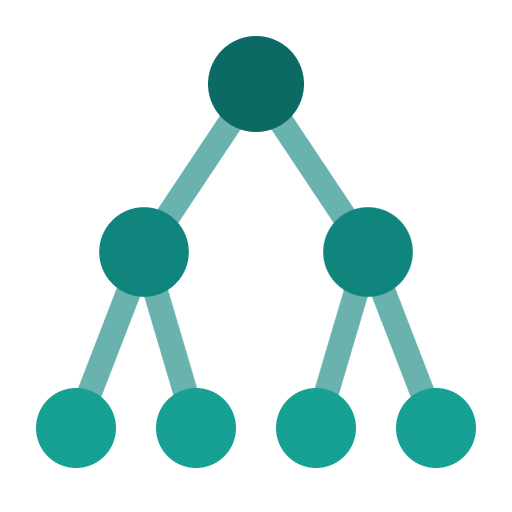
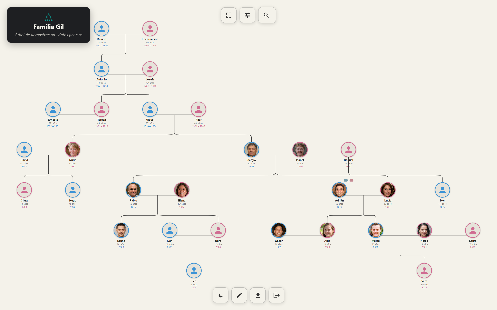
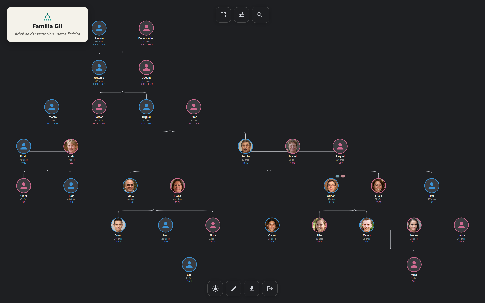
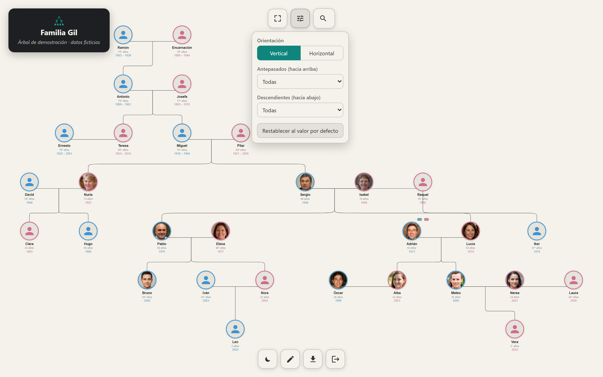
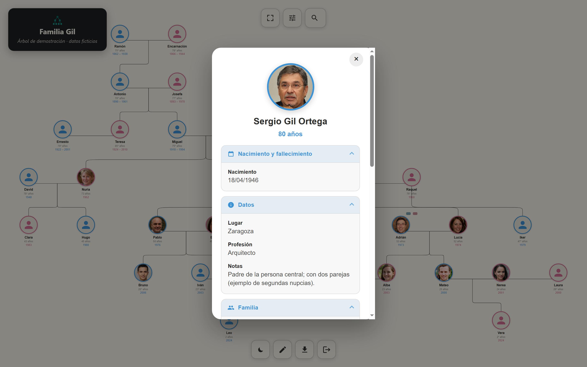
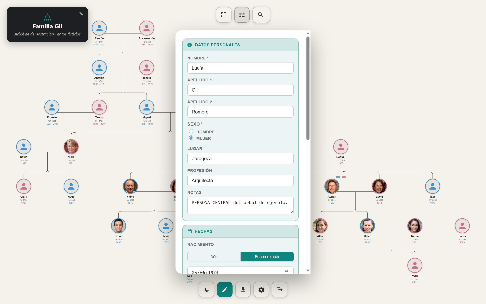
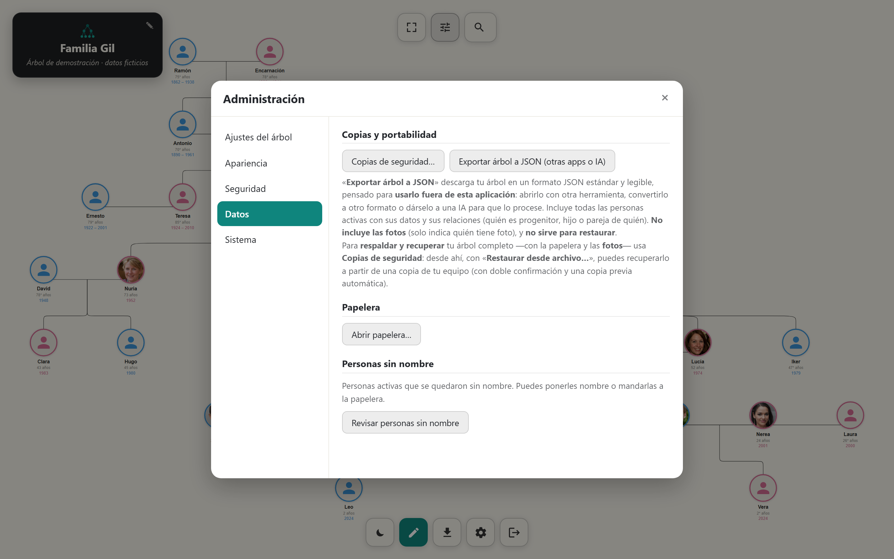
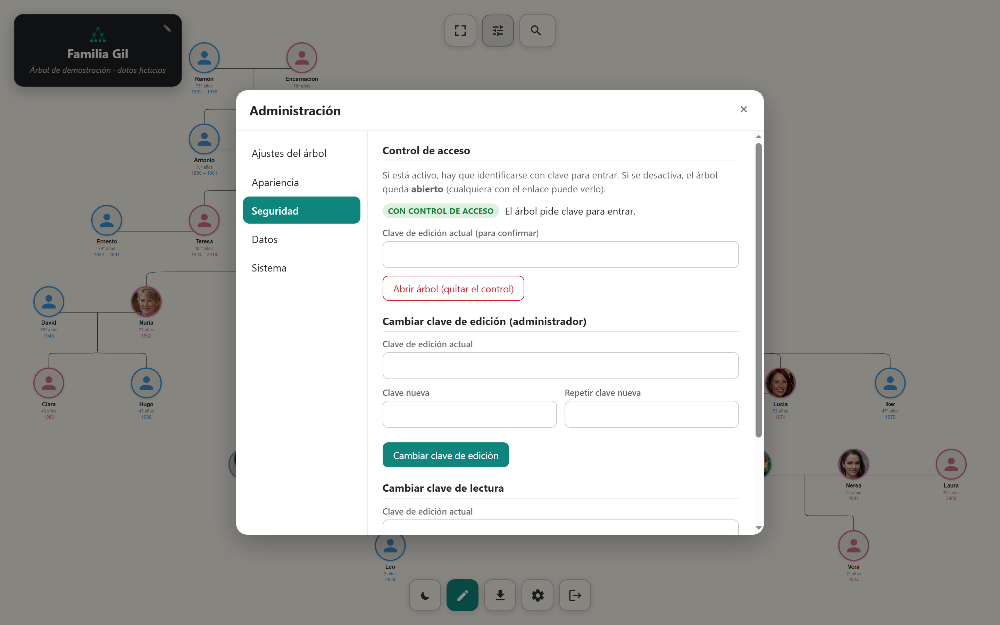
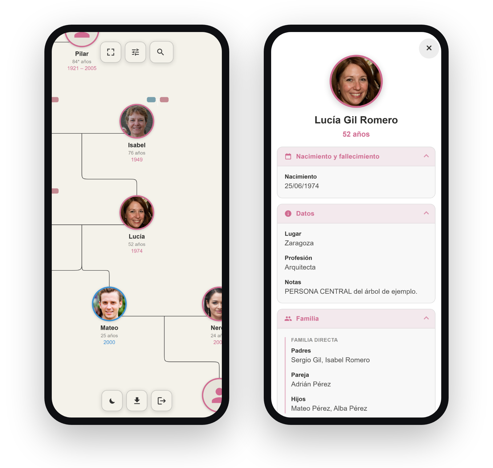
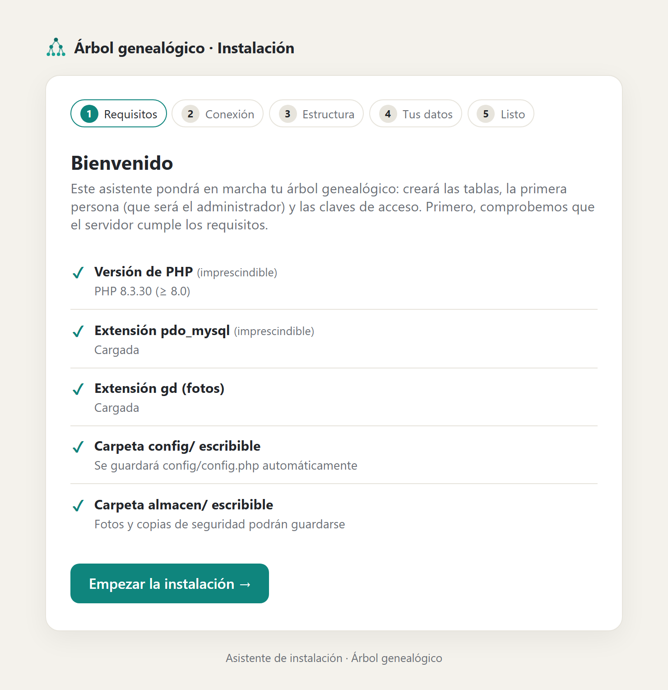

<div align="center">



# Linaje

**Tu árbol genealógico, autoalojado y bajo tu control.**

[](CHANGELOG.md)
[](LICENSE)
[](https://www.php.net/)
[](https://mariadb.org/)
[](#stack-tecnológico)

</div>

<div align="center">

### 🌳 Ver la demo en vivo → **[linaje.antonioblanquez.es](https://linaje.antonioblanquez.es)**

</div>

> **Explórala sin instalar nada.** Es el árbol de la familia **«Gil»** —personas y fotos
> **ficticias**, generadas por IA—, abierto en **modo lectura sin registro**. ¿Quieres
> probar la **edición y el panel de administración**? Entra con la clave de demo
> **`editar1234`**.
>
> 🔄 **Trastea sin miedo:** la demo **se restablece sola cada hora**, así que cualquier
> cambio que hagas se borra automáticamente (es a propósito, no es un fallo).

---

## Qué es Linaje

**Linaje** es una aplicación web para **crear, visualizar y mantener tu árbol
genealógico familiar**. Se instala en tu propio servidor —como un WordPress— así
que **tus datos y las fotos de tu familia son tuyos y viven donde tú decides**, sin
depender de ninguna plataforma externa.

Dibuja el árbol de forma **egocéntrica** (girando alrededor de la persona que
elijas), calcula **automáticamente el parentesco** de cada familiar, permite
**editar todo en español** con fotos y fechas, y protege tus datos con **integridad
garantizada, papelera, copias de seguridad y exportación**. Toda la administración
—incluido el acceso público o privado— se hace desde un **panel integrado**, y la
puesta en marcha es un **instalador guiado** de un par de minutos.

¿Prefieres verlo antes de instalarlo? Echa un vistazo a la
**[demo en vivo](https://linaje.antonioblanquez.es)**.

<div align="center">

<br><em>El árbol interactivo (datos de demostración ficticios).</em>
</div>

---

## Por qué Linaje

Vengo de una familia grande y muy unida. Desde hace años, mi padre había ido
recopilando con paciencia los datos de nuestro árbol genealógico: nombres, fechas,
parentescos e historias que se remontan varias generaciones atrás. Todo ese trabajo
vivía en papeles y archivos sueltos que un día podían perderse y, con ellos, buena
parte de la memoria de quiénes somos y de dónde venimos.

Linaje nació para que eso no pasara: para **digitalizar ese legado** y ponerlo al
alcance de **toda la familia**, hoy y dentro de muchos años. Quería que fuese un
regalo capaz de **sobrevivir a las generaciones**. Ese «por qué» guió cada decisión
del «cómo»: es **autoalojado** —los datos son de la familia, no de una plataforma que
puede cerrar mañana—, con **copias de seguridad robustas** y **exportación completa**
de todo, para que el árbol **perdure pase lo que pase**.

---

## Capturas

> ℹ️ Las caras del árbol de demostración son **rostros de personas que no existen**,
> generados por IA ([thispersondoesnotexist.com](https://thispersondoesnotexist.com) /
> StyleGAN2); no representan a personas reales. Ver
> [THIRD-PARTY-NOTICES.md](THIRD-PARTY-NOTICES.md).

### Visualización

<div align="center">

<br><em>El mismo árbol en <strong>tema oscuro</strong> (arriba, la portada, lo muestra en tema claro).</em>
</div>

<div align="center">

<br><em>Control <strong>Vista</strong>: orientación (vertical/horizontal) y cuántas generaciones de <strong>antepasados y descendientes</strong> mostrar.</em>
</div>

### Consulta y edición

<table>
  <tr>
    <td width="50%">
      
      <p align="center"><em>Ficha de lectura, con el <strong>parentesco</strong> calculado.</em></p>
    </td>
    <td width="50%">
      
      <p align="center"><em>Edición completa, <strong>en español</strong>.</em></p>
    </td>
  </tr>
</table>

### Panel de administración

<table>
  <tr>
    <td width="50%">
      
      <p align="center"><em>Copias de seguridad, papelera y exportación.</em></p>
    </td>
    <td width="50%">
      
      <p align="center"><em>Control de acceso público/privado y claves.</em></p>
    </td>
  </tr>
</table>

### En el móvil

<div align="center">

<br><em><strong>Responsive</strong>: el árbol y las fichas se adaptan a la pantalla.</em>
</div>

### Instalación guiada

<div align="center">

<br><em>Un <strong>instalador guiado</strong>, como el de WordPress: en marcha en un par de minutos.</em>
</div>

---

## Características

**Visualización y navegación**
- Árbol **egocéntrico** interactivo: gira alrededor de cualquier persona.
- Tarjetas con **foto** o, si no la hay, un **aro por sexo y edad**.
- Zoom, desplazamiento, orientación **vertical u horizontal**, control del número de
  **generaciones** visibles y «volver al inicio».
- **Buscador** de personas por nombre o por año.
- **Tema claro y oscuro**, y **exportación del árbol a imagen (PNG) o PDF**.

**Fichas y parentescos**
- **Ficha de lectura** clara y en acordeón (todo plegado al abrir).
- Cálculo **automático del parentesco** de cada persona respecto a la principal
  (padres, abuelos, tíos, primos, cónyuges… incluidas las segundas nupcias).

**Edición**
- Crear y editar personas con todos los campos **en español**, con **validaciones en
  vivo** (campos obligatorios, fechas imposibles).
- **Fotografías**: subir, cambiar o quitar; las imágenes se reescalan y se limpian de
  metadatos (EXIF).
- **Añadir familiares** (padre, madre, pareja, hijo/a) con una coreografía guiada.
- **Deshacer y rehacer** de todas las acciones, con red de seguridad ante pérdidas.

**Tus datos, a salvo**
- **Integridad garantizada**: el servidor rechaza árboles imposibles (ciclos, más de
  dos progenitores, fechas incoherentes entre generaciones).
- **Papelera**: restaura o elimina definitivamente; impide dejar el árbol
  desconectado.
- **Copias de seguridad** completas (datos y fotos), con copia previa automática y
  retención de las más recientes.
- **Exportación a JSON** portable y autoexplicativo.

**Administración y acceso**
- **Panel de administración** con ajustes, apariencia, seguridad, datos y sistema.
- **Modo de acceso configurable**: árbol **privado** (requiere iniciar sesión) o
  **abierto** (lectura pública; administrar siempre exige clave).
- **Instalador guiado** que arranca la aplicación paso a paso y se autobloquea al
  terminar.

**Plataforma**
- **Autoalojado**: tus datos y las fotos de tu familia viven en tu propio servidor.
- **Responsive**: móvil, tablet y escritorio.
- **Páginas de error propias** con la marca, y cabeceras de seguridad en todo el sitio.

> 🔒 La seguridad tiene **sección propia** más abajo: [**Seguridad**](#seguridad).

---

## Seguridad

Linaje guarda datos personales de tu familia, así que la seguridad se ha tratado
como una **prioridad de diseño**, no como un añadido. La aplicación pasó por un
proceso serio de **endurecimiento y auditoría**, con un principio de fondo: **el
servidor es la única autoridad** y nada se da por bueno solo porque llegue del
navegador.

- **Validación en el servidor** como autoridad: el cliente solo ayuda; las reglas
  críticas se comprueban (y se imponen) en el backend.
- **Protección frente a ataques web**: defensa contra **XSS**, **CSRF** e
  **inyección SQL** (consultas siempre parametrizadas con PDO).
- **CSP estricta**, sin `unsafe-inline`, para acotar drásticamente qué puede
  ejecutarse en la página.
- **Límite de intentos por IP** en el acceso, para frenar la fuerza bruta.
- **Subida de fotos saneada**: cada imagen se **reprocesa** (se vuelve a codificar
  desde cero) y se le **eliminan los metadatos EXIF**, evitando archivos disfrazados
  y fugas de datos de ubicación.
- **Control de integridad del árbol**: el servidor **rechaza estructuras imposibles**
  —ciclos, exceso de progenitores, fechas incoherentes entre generaciones.
- **Operaciones atómicas** y **copias de seguridad verificadas** (con manifiesto de
  recuentos), para que los datos nunca queden a medias.
- **Instalador que se autobloquea** al terminar, y **contraseñas siempre cifradas**
  (hash), nunca en claro.

---

## Stack tecnológico

Linaje está hecho **a propósito con tecnología sencilla y sin frameworks**, para que
sea fácil de entender, desplegar y mantener en cualquier hosting compartido.

| Capa | Tecnología |
|------|------------|
| **Backend** | **PHP 8 vanilla** (sin frameworks), PDO |
| **Base de datos** | **MySQL / MariaDB** (tablas con prefijo `arb_`) |
| **Frontend** | **JavaScript vanilla** (ES, sin *build step*) |
| **Visualización** | [D3.js](https://d3js.org/) + [family-chart](https://donatso.github.io/family-chart/) |
| **Exportación** | [jsPDF](https://github.com/parallax/jsPDF), [html-to-image](https://github.com/bubkoo/html-to-image) |
| **Servidor** | Apache o LiteSpeed (compatibles con `.htaccess`); pensado para hosting tipo Hostinger |

**Arquitectura** (resumen):

```
public/        ← DOCUMENT ROOT (lo único accesible por web)
  index.php    ← punto de entrada de la app
  api/         ← endpoints JSON (lectura y escritura)
  instalar/    ← asistente de instalación
  assets/      ← CSS, JS propio y librerías de terceros (vendor/)
src/           ← lógica de negocio (clases PHP), FUERA del document root
almacen/       ← fotos, copias y datos locales, FUERA del document root
config/        ← configuración (config.php real, ignorado por git)
```

El *document root* apunta a `public/`, de modo que el código de negocio (`src/`), la
configuración (`config/`) y los datos (`almacen/`) **nunca son accesibles por web**.

---

## Instalación

### Requisitos

- **PHP 8.0 o superior** (probado en 8.3) con las extensiones `pdo_mysql` y `gd`.
- **MySQL** o **MariaDB**.
- **Apache** o **LiteSpeed** con `mod_rewrite` y `AllowOverride All` (o un servidor
  equivalente que respete los `.htaccess`).
- Permisos de escritura en las carpetas `config/` y `almacen/`.

### Pasos

1. **Clona el repositorio** en tu servidor:
   ```bash
   git clone https://github.com/<tu-usuario>/linaje.git
   cd linaje
   ```

2. **Apunta el _document root_ del dominio a la carpeta `public/`**. Es el paso más
   importante: nunca sirvas la raíz del proyecto, solo `public/`.

3. **Crea una base de datos vacía** (MySQL/MariaDB) y anota su nombre, usuario y
   contraseña.

4. **Configura la conexión.** Tienes dos opciones:
   - Deja que el **instalador** cree `config/config.php` por ti (recomendado), o
   - Copia la plantilla a mano y rellénala:
     ```bash
     cp config/config.example.php config/config.php
     ```

5. **Abre el sitio en el navegador.** Si aún no está instalado, te llevará al
   **asistente** (`/instalar/`), que te guía por: requisitos → conexión → estructura
   → primera persona y claves → listo. Al terminar, el instalador se **autobloquea**.

6. **¡Listo!** Ya puedes entrar a tu árbol.

> 💡 En **hosting compartido** (p. ej. Hostinger) el proceso es el mismo: sube los
> archivos, haz que el dominio apunte a `public/`, crea la base de datos desde el
> panel y abre la web para lanzar el instalador.
>
> Si tu hosting **no permite cambiar el _document root_** (es el caso de Hostinger, que
> lo fija en `public_html/`), coloca el proyecto **fuera** de `public_html` y sustituye
> esa carpeta por un **enlace simbólico** a `public/`:
> ```bash
> ln -s /home/USUARIO/ruta/al/proyecto/public public_html
> ```
> Así el resto del código (`src/`, `config/`, `almacen/`) sigue **fuera** del alcance web.

---

## Uso básico

- **Inicia sesión** con los datos de la primera persona (el administrador) y tu clave.
- El árbol arranca centrado en esa persona. **Pulsa cualquier tarjeta** para abrir su
  **ficha** y ver sus datos y su parentesco.
- Entra en **modo edición** (el lápiz) para **añadir familiares** (botón +),
  **editar** personas, subir **fotos** y ajustar el **título** del árbol.
- Usa el **buscador** (la lupa) para saltar a cualquier persona, y **⚙** para abrir el
  **panel de administración** (copias, papelera, acceso, exportación, apariencia…).

---

## Hoja de ruta

Linaje es un **proyecto vivo**.

✅ **Ya disponible:** demo pública en vivo, instalador guiado, copias de seguridad y
exportación completas, y control de acceso público/privado (privado o abierto).

Estas son algunas de las **mejoras previstas** (planes, sin fechas comprometidas):

- **Ayuda integrada**: guía de uso y ayuda contextual dentro de la propia aplicación.
- **Cuentas de usuario por persona**: acceso individual para cada familiar, con
  permisos.
- **Actualización asistida**: actualizar la aplicación —al estilo WordPress— sin
  perder datos.
- **Soporte multi-árbol**: gestionar varias familias en una misma instalación.
- **Tanda de mejoras de calidad**: revisión de código, rendimiento y accesibilidad.

---

## Licencia y créditos

Linaje se publica bajo la **[Licencia Apache 2.0](LICENSE)**.

© 2026 **Antonio Blánquez Cabeza**.

Este proyecto incluye librerías de terceros (D3.js, family-chart, jsPDF y
html-to-image) bajo licencias permisivas **MIT** e **ISC**, compatibles con Apache
2.0. Sus avisos y licencias están recogidos en
**[THIRD-PARTY-NOTICES.md](THIRD-PARTY-NOTICES.md)**.

El historial de versiones está en **[CHANGELOG.md](CHANGELOG.md)**.
